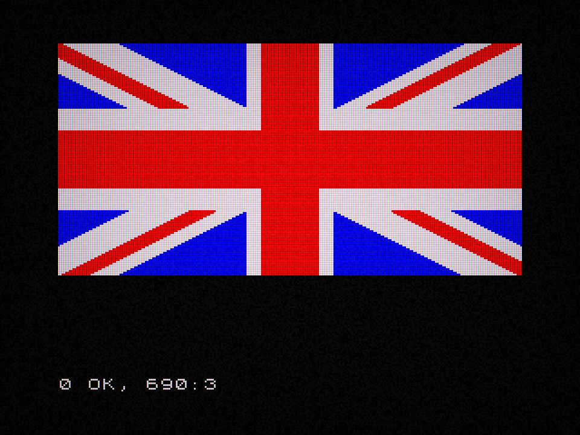
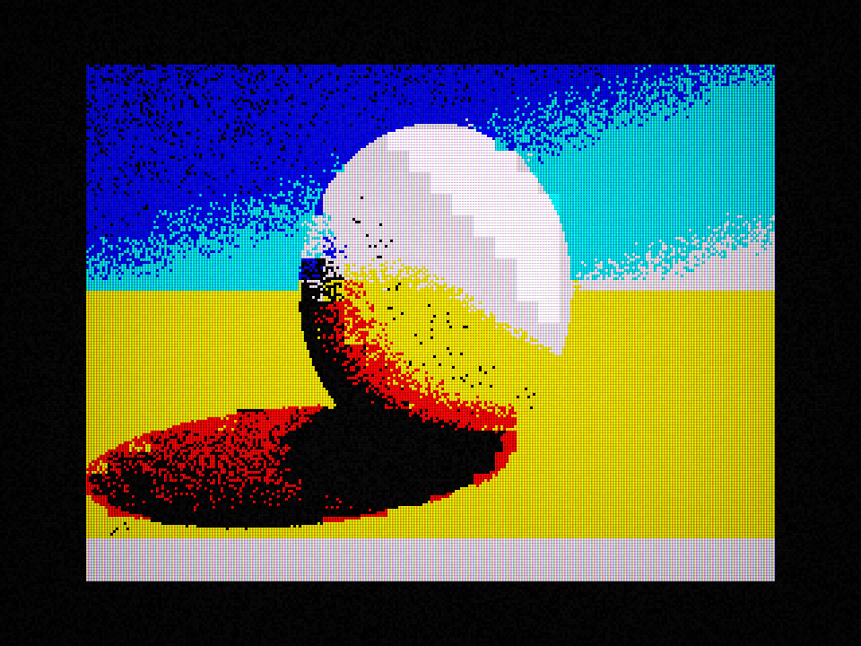

# ZXBasic

**Tiny programs. Glorious pixels. Just one more `RUN`.**

The joy of ZX Spectrum BASIC, with a keyboard that behaves itself. Write a few lines, hit `RUN`, and make something colorful on a 256×192 screen — complete with color clash and an optional CRT glow.

[**Download ZXBasic**](https://github.com/deanthecoder/ZXBasic/releases/latest) · [Try an example](#pick-something-to-play-with) · [Build from source](#build-from-source)

<table>
  <tr>
    <td align="center"><a href="Examples/UnionJack/UnionJack.bas"></a><br><strong>Union Jack</strong> — <code>PLOT</code>, <code>DRAW</code>, and a splash of color.</td>
    <td align="center"><a href="Examples/HumanShader/HumanShader.bas"></a><br><strong>Human Shader</strong> — a whole scene, calculated in BASIC.</td>
    <td align="center"><a href="Examples/ThunderCats/ThunderCats.bas"></a><br><strong>ThunderCats</strong> — <code>CIRCLE</code>, <code>DRAW</code>, and a carefully closed <code>FILL</code>.</td>
  </tr>
</table>

These are program outputs, captured with **File → Save Screenshot**. Click either picture for its source. Human Shader is inspired by [humanshader.com](https://humanshader.com/). To run it, set the walking/running toolbar icon to **Unlimited** and let it cook.

## Old-school fun, everyday comforts

- **Type normally.** Native keyboard input, automatic uppercase, and whole listings pasted in one go.
- **Tinker quickly.** Click a listed line to edit it, scroll with the mouse wheel, and press Escape to stop a running program.
- **Keep the look.** Spectrum colors, flashing attributes, custom characters, and a switchable phosphor CRT effect.
- **Skip the wait.** Choose Spectrum speed, 10× Fast, or Unlimited — even while a program runs.
- **Bring your programs.** Open and save `.bas` files, import BASIC from 48K `.sna` snapshots, or drop either onto the window.
- **Play with the mouse.** Draw, erase, and flood-fill in the included Mouse Paint example.

## Your first pixels in 30 seconds

Paste this into ZXBasic, type `RUN`, and press Enter. That's the whole program:

```basic
10 BORDER 0: PAPER 0: INK 6: BRIGHT 1: CLS
20 FOR A=0 TO 2*PI STEP PI/36
30 PLOT 128,88
40 DRAW 80*COS A,80*SIN A
50 NEXT A
```

Change `INK 6` to `INK 3`. Try a different angle step. Run it again. You're programming a Spectrum.

## Pick something to play with

Open a listing with **File → Open**, `Ctrl+O` (`⌘+O` on macOS), or drag and drop. Then type `RUN`.

| Program | What's the fun bit? |
| --- | --- |
| [Human Shader](Examples/HumanShader/HumanShader.bas) | Build a scene a block at a time. **Unlimited recommended.** Also available as a [.sna snapshot](Examples/HumanShader/HumanShader.sna). |
| [Union Jack](Examples/UnionJack/UnionJack.bas) | See how a few graphics commands and Spectrum attributes draw the flag above. |
| [Mouse Paint](Examples/MousePaint/MousePaint.bas) | Doodle with normal and bright inks, an eraser, and flood fill. |
| [3D Spinning Cube](Examples/CubeSpinner/CubeSpinner.bas) | Arrays + trigonometry + `DRAW` = a rotating wireframe cube. |
| [Conway's Game of Life](Examples/Conway/Conway.bas) | Watch tiny patterns live, grow, and disappear. Also available as a [.sna snapshot](Examples/Conway/Conway.sna). |
| [Web](Examples/Web/Web.bas) | Turn straight lines into a colorful animated web. |
| [DTC](Examples/DTC/DTC.bas) | Make your own characters with `POKE` and `CHR$`. |
| [FRAMES Clock](Examples/FramesClock/FramesClock.bas) | Turn the Spectrum's 50 Hz counter into a clock. |
| [Joystick Move](Examples/JoystickMove/JoystickMove.bas) | Steer a `*` with the arrow keys and `IN 31`. |

<details>
<summary><strong>Show me the complete Web source — just 17 lines</strong></summary>

```basic
10 LET I=0
20 FOR S=20 TO 50 STEP 2
30 LET I=I+1:IF I>6 THEN LET I=0
40 CLS
50 INK I
60 LET DX=255/S
70 LET DY=175/S
80 FOR N=0 TO S-1
90 LET DXN=INT(DX*N)
100 LET DYN=INT(DY*N)
110 PLOT DXN,0
120 DRAW -DXN,175-DYN
130 DRAW 255-DXN,DYN
140 DRAW DXN,-175+DYN
150 DRAW -255+DXN,-DYN
160 NEXT N
170 NEXT S
```

</details>

<details>
<summary><strong>See Conway's Game of Life in action</strong></summary>


</details>

## A little further down the rabbit hole

<details>
<summary><strong>Editing programs and useful commands</strong></summary>


Type a numbered line and press Enter to add or replace it:

```basic
10 BORDER 1
20 FOR A=-99 TO 99
30 PLOT A+110,80+30*SIN (A/12)
40 NEXT A
50 PAUSE 0
```

The program automatically lists around the line you entered. The `>` marker follows the newest or selected line. Entering a line number on its own deletes that line.

Useful immediate commands include:

```basic
LIST
RUN
RUN 100
CONTINUE
BORDER 3: PAPER 2: CLS
RENUMBER 10,10
NEW
```

Paste several numbered lines at once to add a complete listing. Direct commands can also contain multiple statements separated by colons. Escape clears the line currently being edited; while a program is running it breaks execution instead.

The walking/running toolbar icon rotates between Spectrum, Fast, and Unlimited speed. You can change speed while a program is running. Display → CRT effect switches between the processed phosphor treatment and a clean pixel display.

</details>

<details>
<summary><strong>Language support and Spectrum memory</strong></summary>


ZXBasic currently supports the core language needed by sizeable Spectrum programs:

- Numeric and string variables, expressions, slicing, and standard math/string functions.
- `LET`, `IF`/`THEN`, `FOR`/`NEXT`, `GO TO`, `GO SUB`, `RETURN`, `STOP`, `CONTINUE`, and `PAUSE`.
- Numeric and string arrays through `DIM`, plus `ERASE`.
- `DEF FN` / `DEFFN`, `DATA`, `READ`, `RESTORE`, `INPUT`, and `INPUT LINE`.
- `PRINT`, `AT`, `TAB`, print zones, scrolling, embedded color controls, block graphics, and UDGs.
- `PLOT`, `DRAW`, curved `DRAW`, `CIRCLE`, `FILL`, `POINT`, `ATTR`, and `SCREEN$`.
- `INK`, `PAPER`, `BRIGHT`, `FLASH`, `INVERSE`, `OVER`, `BORDER`, and `CLS`.
- `PEEK`, `POKE`, `CLEAR`, `RANDOMIZE`, `RND`, `INKEY$`, `REM`, and silent `BEEP`.
- `IN 31` for cursor-key joystick input: right `1`, left `2`, down `4`, and up `8`.

Display memory follows the Spectrum layout: addresses `16384`–`22527` expose its non-linear bitmap rows, and `22528`–`23295` expose the 32×24 color attribute map.

The 24-bit `FRAMES` system variable is available little-endian at addresses `23672`–`23674`. It advances continuously at the PAL Spectrum rate of 50 Hz, wraps after `16777215`, and can also be changed with `POKE`.

</details>

<details>
<summary><strong>Font and mouse extension details</strong></summary>

### Spectrum font

The original 96-character, 8×8 font is extracted from the standard Spectrum 48K ROM at development time and encoded directly in ZXBasic. No ROM file is required at runtime.

### Mouse extension

Mouse input is available to BASIC programs as live, read-only numeric variables. `_MX` and `_MY` use Spectrum pixel coordinates, with `(0,0)` at the bottom-left. Reading `_MX` samples the latest pointer position; `_OMX` and `_OMY` contain the preceding sample, which makes continuous lines easy to draw when pointer events skip pixels. `_MX` and `_MY` are `-1` while the pointer is outside the display. `_MB` is a button bitmask: `1` for left, `2` for right, and `4` for middle.

The safe Spectrum expression `USR "A"` is supported for locating user-defined graphics data; letters `A` through `U` map to their traditional eight-byte RAM slots. `CHR$ 144` through `CHR$ 164` print those glyphs after their data has been written with `POKE`. Numeric `USR` and machine-code execution remain unsupported.

</details>

## Download

Installers are attached to the [latest GitHub release](https://github.com/deanthecoder/ZXBasic/releases/latest):

- **Windows:** x64 Inno Setup installer, including the OpenAL runtime.
- **macOS:** Apple Silicon and Intel disk images.

## Build from source

ZXBasic requires the [.NET 9 SDK](https://dotnet.microsoft.com/download/dotnet/9.0). It uses [Avalonia](https://avaloniaui.net/) for its cross-platform desktop interface.

```text
git clone --recurse-submodules https://github.com/deanthecoder/ZXBasic.git
cd ZXBasic
dotnet build ZXBasic.sln
dotnet test ZXBasic.sln
dotnet run --project src/ZXBasic/ZXBasic.csproj
```

To create local installers:

```text
python Installer/pack.py
```

The GitHub Actions installer workflow builds the Windows and macOS packages and can publish them directly to a tagged GitHub release.

## Compatibility

ZXBasic interprets BASIC directly; it is not a machine emulator. Z80 machine code and `RANDOMIZE USR` are outside its scope. `IN 31` is available for cursor-key joystick input; other hardware-specific `IN` ports, `OUT`, printer commands, and tape commands are not supported. `BEEP` accepts and observes the requested duration without producing sound.

Snapshot import supports uncompressed 48K `.sna` files and extracts their BASIC program. Other machine state and embedded machine-code routines are not executed.

## License

ZXBasic source code, embedded font data, and the included example programs are available under the [MIT License](LICENSE).

---

[Follow @deanthecoder](https://twitter.com/deanthecoder) · [Star ZXBasic](https://github.com/deanthecoder/ZXBasic/stargazers)
