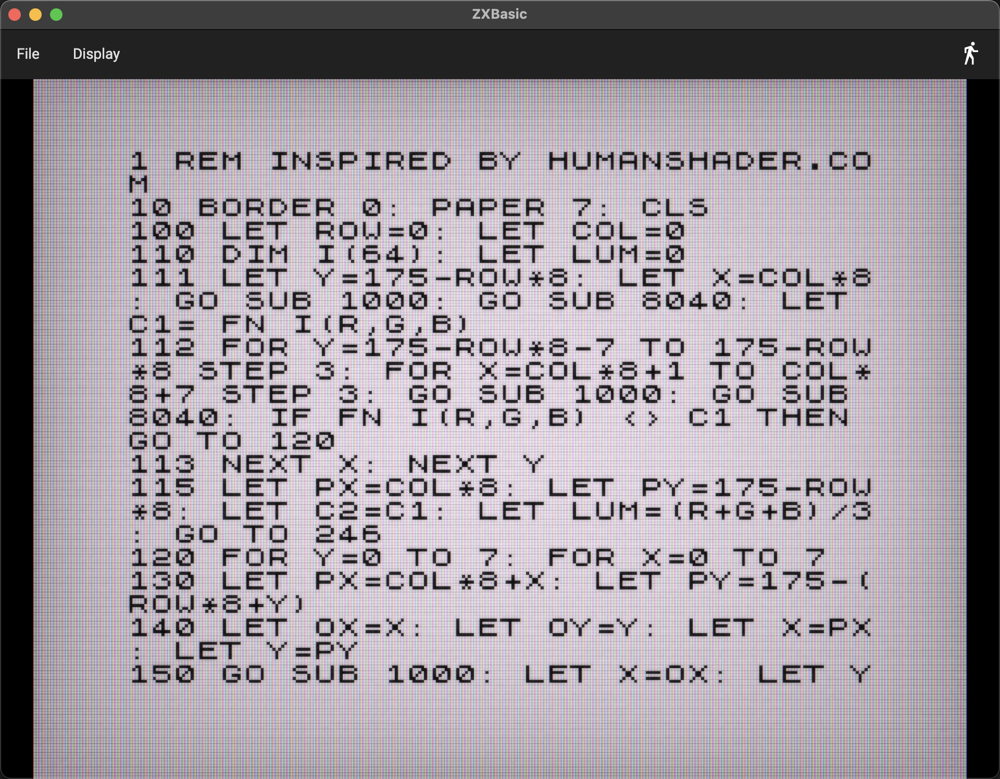
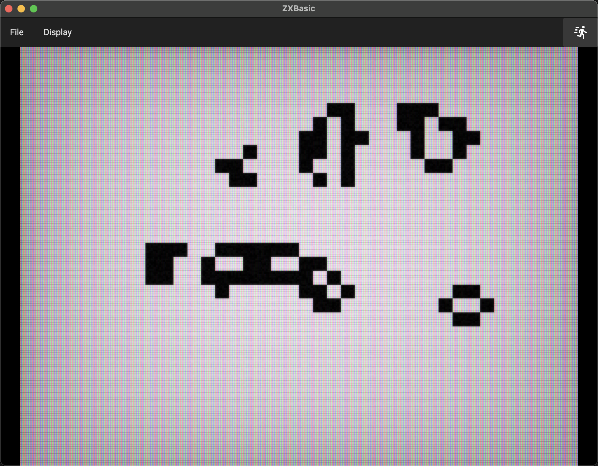

[](https://twitter.com/deanthecoder)
[](https://github.com/deanthecoder/ZXBasic/stargazers)

# ZXBasic

**ZX Spectrum BASIC, rebuilt as a modern cross-platform Avalonia application.**

ZXBasic recreates the friendly immediacy of programming a ZX Spectrum without emulating its Z80 processor. Enter numbered Sinclair BASIC lines, type `RUN`, and watch them execute on an authentic 256×192 display—with color clash, ROM lettering, flashing cursor modes, and an optional phosphor CRT effect.



## Highlights

- Sinclair BASIC syntax with numbered programs and immediate commands.
- Native keyboard entry, automatic uppercase conversion, multiline paste, and `GOTO`, `GOSUB`, and `DEFFN` aliases.
- Click a listed line to edit it; use arrows, Home, End, Backspace, and Delete normally.
- Scroll long listings with the mouse wheel.
- Authentic 256×192 bitmap, 32×24 attributes, Spectrum palette, bright and flash colors, border, and color clash.
- ZXSpeculator-style CRT rendering with RGB phosphors, scanlines, grain, saturation, vignetting, and soft glow.
- Approximate Spectrum BASIC speed, 10× Fast mode, and Unlimited execution for demanding programs.
- Press Escape at any time to break into a running program.
- Load and save readable `.bas` listings, and import tokenized BASIC from 48K `.sna` snapshots through the File menu, `Ctrl/Command+O`, or drag and drop.
- Read live Spectrum-coordinate mouse input from `_MX`, `_MY`, `_OMX`, `_OMY`, and `_MB`.
- Live `PEEK` and `POKE` access to Spectrum bitmap and attribute memory.
- `RENUM` / `RENUMBER` extension for modern convenience.

## Included examples

Eight complete programs are included as readable BASIC listings; Human Shader and Conway also include ready-to-open snapshots:

- [Human Shader](Examples/HumanShader/HumanShader.bas) — a substantial graphics program inspired by [humanshader.com](https://humanshader.com/). Open [HumanShader.sna](Examples/HumanShader/HumanShader.sna) and select Unlimited speed unless you fancy the original wait.
- [Conway's Game of Life](Examples/Conway/Conway.bas) — uses the Spectrum attribute map as both its display and working data. Open [Conway.sna](Examples/Conway/Conway.sna) to run it directly.
- [Mouse Paint](Examples/MousePaint/MousePaint.bas) — hold the left mouse button to draw, click `NEW` to clear, or click a color swatch to change ink.
- [Joystick Move](Examples/JoystickMove/JoystickMove.bas) — move a `*` with the arrow keys using the Kempston-compatible `IN 31` input port.
- [3D Spinning Cube](Examples/CubeSpinner/CubeSpinner.bas) — rotate and project a wireframe cube using arrays, trigonometry, and `DRAW`.
- [DTC](Examples/DTC/DTC.bas) — define two custom characters with `POKE`, then print them with `CHR$`.
- [Union Jack](Examples/UnionJack/UnionJack.bas) — draw the Union Jack with Spectrum graphics commands and color attributes.
- [Web](Examples/Web/Web.bas) — animate a colorful web pattern with repeated `PLOT` and `DRAW` operations.



## Using ZXBasic

Type a numbered line and press Enter to add or replace it:

```basic
10 BORDER 1
20 FOR A=-99 TO 99
30 PLOT A+110,80+30*SIN (A/12)
40 NEXT A
50 PAUSE 0
```

The program automatically lists around the line you entered. The `>` marker follows the newest or selected line. Entering a line number on its own deletes that line.

Useful immediate commands include:

```basic
LIST
RUN
RUN 100
BORDER 3: PAPER 2: CLS
RENUMBER 10,10
NEW
```

Paste several numbered lines at once to add a complete listing. Direct commands can also contain multiple statements separated by colons. Escape clears the line currently being edited; while a program is running it breaks execution instead.

The walking/running toolbar icon rotates between Spectrum, Fast, and Unlimited speed. You can change speed while a program is running. Display → CRT effect switches between the processed phosphor treatment and a clean pixel display.

## Language support

ZXBasic currently supports the core language needed by sizeable Spectrum programs:

- Numeric and string variables, expressions, slicing, and standard math/string functions.
- `LET`, `IF`/`THEN`, `FOR`/`NEXT`, `GO TO`, `GO SUB`, `RETURN`, `STOP`, and `PAUSE`.
- Numeric and string arrays through `DIM`, plus `ERASE`.
- `DEF FN` / `DEFFN`, `DATA`, `READ`, `RESTORE`, `INPUT`, and `INPUT LINE`.
- `PRINT`, `AT`, `TAB`, print zones, scrolling, embedded color controls, block graphics, and UDGs.
- `PLOT`, `DRAW`, curved `DRAW`, `CIRCLE`, `POINT`, `ATTR`, and `SCREEN$`.
- `INK`, `PAPER`, `BRIGHT`, `FLASH`, `INVERSE`, `OVER`, `BORDER`, and `CLS`.
- `PEEK`, `POKE`, `CLEAR`, `RANDOMIZE`, `RND`, `INKEY$`, `REM`, and silent `BEEP`.
- `IN 31` for cursor-key joystick input: right `1`, left `2`, down `4`, and up `8`.

Display memory follows the Spectrum layout: addresses `16384`–`22527` expose its non-linear bitmap rows, and `22528`–`23295` expose the 32×24 color attribute map.

## Spectrum font

The original 96-character, 8×8 font is extracted from the standard Spectrum 48K ROM at development time and encoded directly in ZXBasic. No ROM file is required at runtime.

## Mouse extension

Mouse input is available to BASIC programs as live, read-only numeric variables. `_MX` and `_MY` use Spectrum pixel coordinates, with `(0,0)` at the bottom-left. Reading `_MX` samples the latest pointer position; `_OMX` and `_OMY` contain the preceding sample, which makes continuous lines easy to draw when pointer events skip pixels. `_MX` and `_MY` are `-1` while the pointer is outside the display. `_MB` is a button bitmask: `1` for left, `2` for right, and `4` for middle.

The safe Spectrum expression `USR "A"` is supported for locating user-defined graphics data; letters `A` through `U` map to their traditional eight-byte RAM slots. `CHR$ 144` through `CHR$ 164` print those glyphs after their data has been written with `POKE`. Numeric `USR` and machine-code execution remain unsupported.

## Build from source

ZXBasic requires the [.NET 9 SDK](https://dotnet.microsoft.com/download/dotnet/9.0). It uses [Avalonia](https://avaloniaui.net/) for its cross-platform desktop interface.

```text
git clone --recurse-submodules https://github.com/deanthecoder/ZXBasic.git
cd ZXBasic
dotnet build ZXBasic.sln
dotnet test ZXBasic.sln
dotnet run --project src/ZXBasic/ZXBasic.csproj
```

## Compatibility

ZXBasic interprets BASIC directly; it is not a machine emulator. Z80 machine code and `RANDOMIZE USR` are outside its scope. `IN 31` is available for cursor-key joystick input; other hardware-specific `IN` ports, `OUT`, printer commands, and tape commands are not supported. `BEEP` accepts and observes the requested duration without producing sound.

Snapshot import supports uncompressed 48K `.sna` files and extracts their BASIC program. Other machine state and embedded machine-code routines are not executed.

## License

ZXBasic source code, embedded font data, and the included example programs are available under the [MIT License](LICENSE).
